<p align="center">
  <picture>
    <source media="(prefers-color-scheme: dark)" srcset="assets/lockup-white.png">
    
  </picture>
</p>

<p align="center">
  <b>Every Claude Code chat in one window.</b><br>
  Real terminals running the real <code>claude</code>. Grouped into workspaces. The ones that need you on top.
</p>

<p align="center">
  <a href="https://github.com/anessbelbati/lowlit/actions/workflows/check.yml"></a>
  <a href="https://github.com/anessbelbati/lowlit/releases"></a>
  <a href="LICENSE"></a>
  
  
</p>

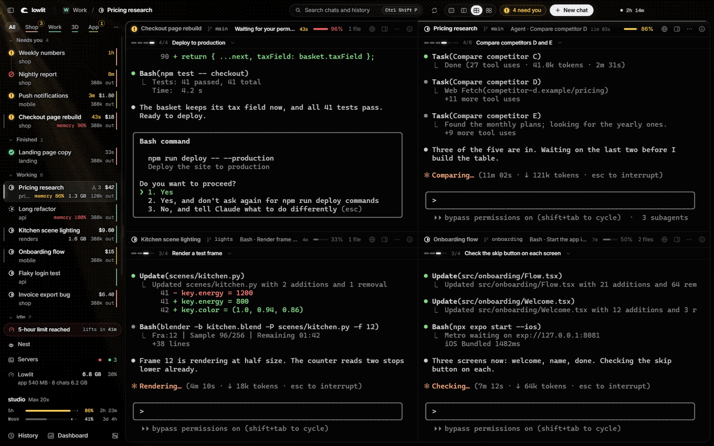

Lowlit is a desktop session manager for Claude Code on Windows. Each chat is a terminal running the `claude` you already have: your settings, hooks, MCP servers, plugins and slash commands work unchanged. Lowlit reads the files Claude Code writes on your disk and shows what they say.

## Install

One line, in PowerShell:

```
irm https://getlowlit.pages.dev/install.ps1 | iex
```

It checks for Git and Node.js, puts Lowlit in `%USERPROFILE%\lowlit`, fetches its parts and opens the window. No administrator rights, nothing compiled, nothing deleted. [The script](site/install.ps1) is short: read it first if you like. The same line updates Lowlit.

Or by hand:

```
git clone https://github.com/anessbelbati/lowlit
cd lowlit
npm install
npm start
```

Either way you need Windows 10 or 11, [Node.js](https://nodejs.org) 22 or newer, Git, and Claude Code installed and logged in (typing `claude` in a terminal starts it). `npm install` downloads Electron and the terminal parts, ready built. Both ways are run on a clean Windows machine at every change to this repository, and the window is started there: that is the first badge above.

To open Lowlit without a terminal, double-click `app\Lowlit.vbs`, or add it to the Start menu in Settings > Opening Lowlit. Chats you start in Lowlit run in Lowlit. The ones already running in other terminals show up in the list too, with their state and their numbers.

## Workspaces

A workspace is a set of folders, with a colour. A chat goes where its folder is.

- Click a tab: only that workspace's chats are left, in the list and on screen.
- `Ctrl`-click a second tab: both at once, each in its own block.
- A tab counts the chats that wait in it.
- `Ctrl Shift 1` is every chat, `Ctrl Shift 2` to `9` the workspaces.

## Also in the window

<table>
  <tr>
    <td width="50%"><a href="site/img/panel.webp">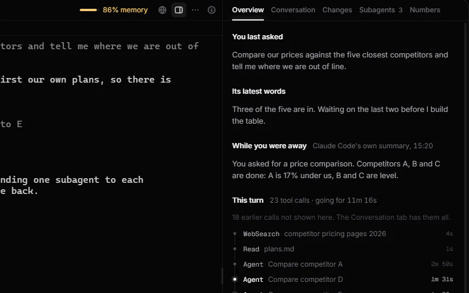</a></td>
    <td width="50%"><a href="site/img/cards.webp">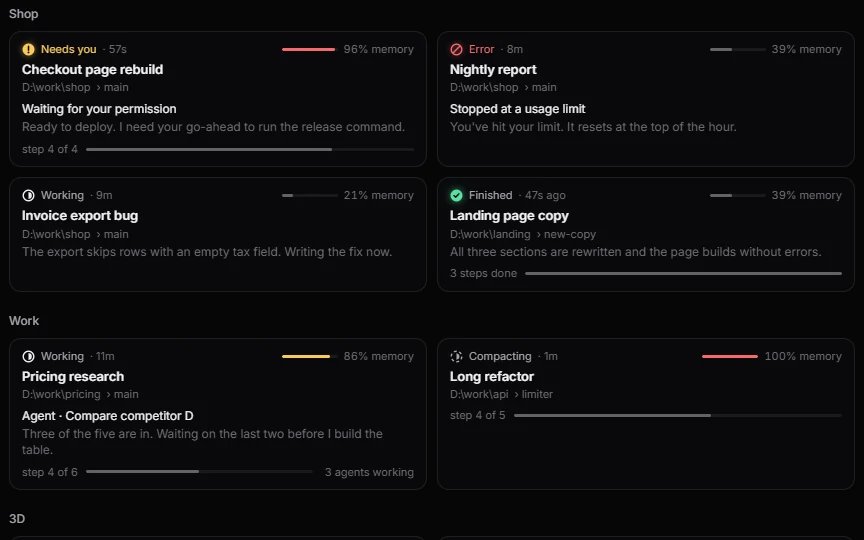</a></td>
  </tr>
  <tr>
    <td><b>Panel.</b> Beside a chat: what you asked, this turn's tool calls, its subagents, what it changed.</td>
    <td><b>Cards.</b> Every chat as a card, by workspace.</td>
  </tr>
  <tr>
    <td><a href="site/img/dashboard-now.webp">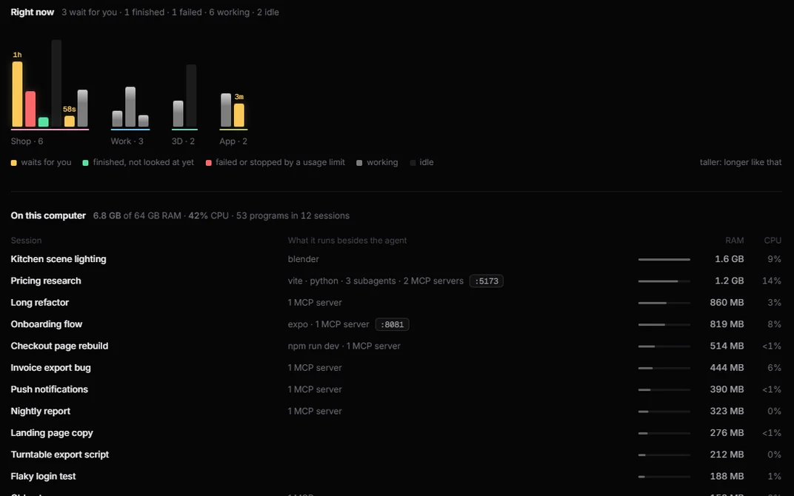</a></td>
    <td><a href="site/img/dashboard-today.webp">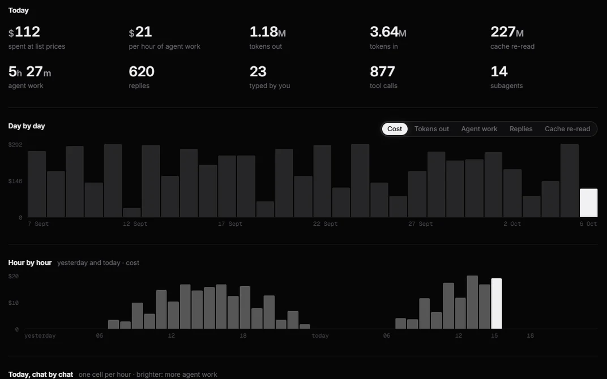</a></td>
  </tr>
  <tr>
    <td><b>Dashboard.</b> What each session runs besides the agent: dev servers, MCP servers, ports, RAM, CPU.</td>
    <td><b>Cost.</b> What today cost at API list prices: by day, by hour, by chat.</td>
  </tr>
  <tr>
    <td><a href="site/img/chat-browser.webp">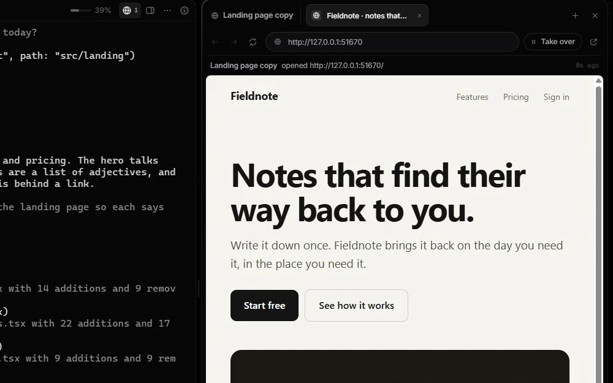</a></td>
    <td><a href="site/img/chat-viewer.webp">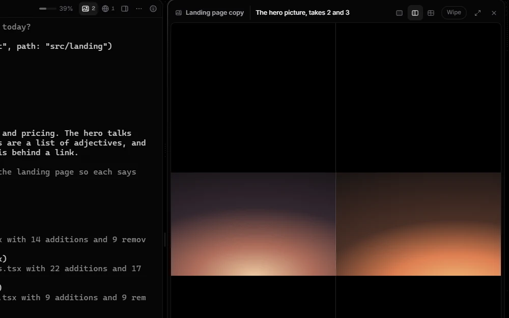</a></td>
  </tr>
  <tr>
    <td><b>Browser.</b> A browser each chat can drive: open, read, click, type, screenshot. Watch, or take over.</td>
    <td><b>Viewer.</b> Pictures, video and sound open beside the chat that made them. Two takes side by side.</td>
  </tr>
  <tr>
    <td><a href="site/img/servers.webp">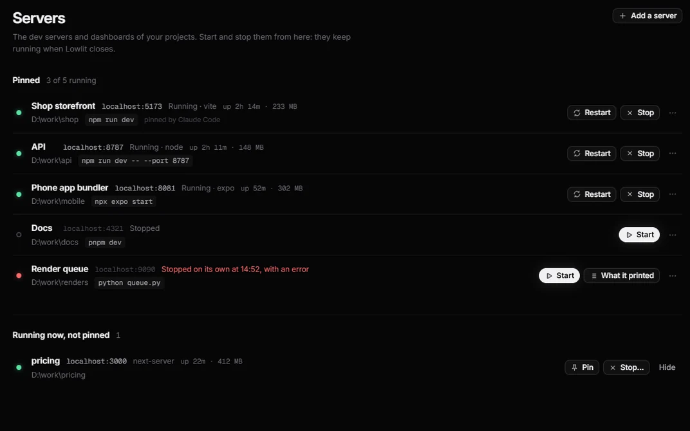</a></td>
    <td><a href="site/img/history.webp">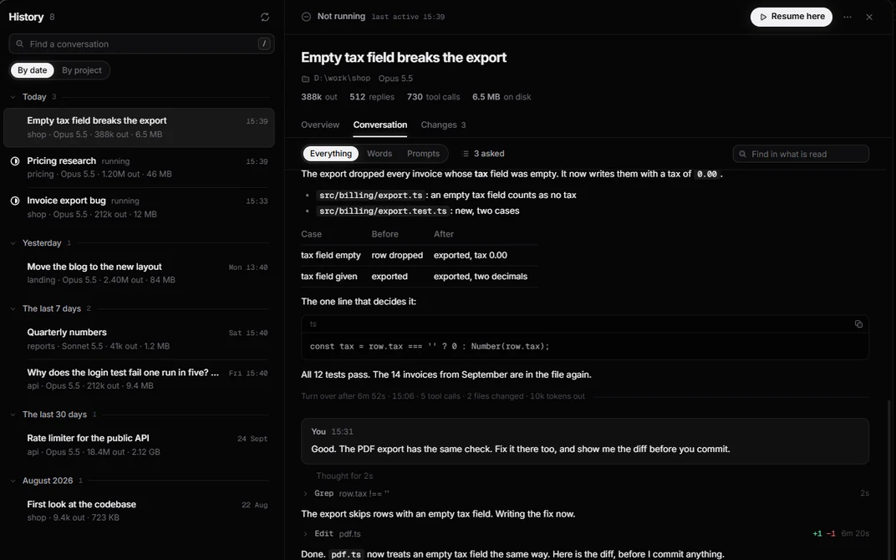</a></td>
  </tr>
  <tr>
    <td><b>Servers.</b> Your dev servers, pinned: start, stop, restart, read what one printed.</td>
    <td><b>History.</b> Every past conversation on the machine. Resume here.</td>
  </tr>
  <tr>
    <td><a href="site/img/search.webp">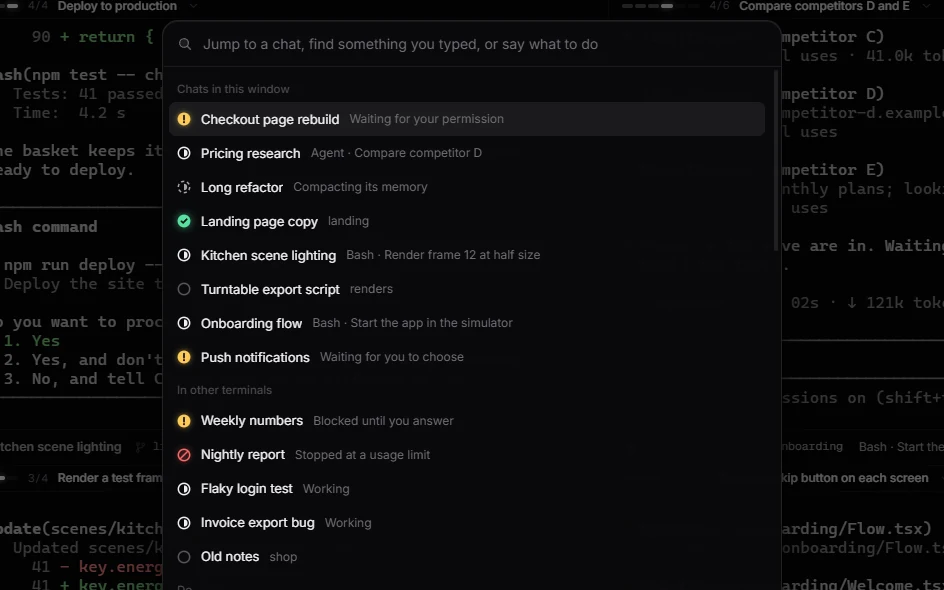</a></td>
    <td><a href="site/img/closing.webp">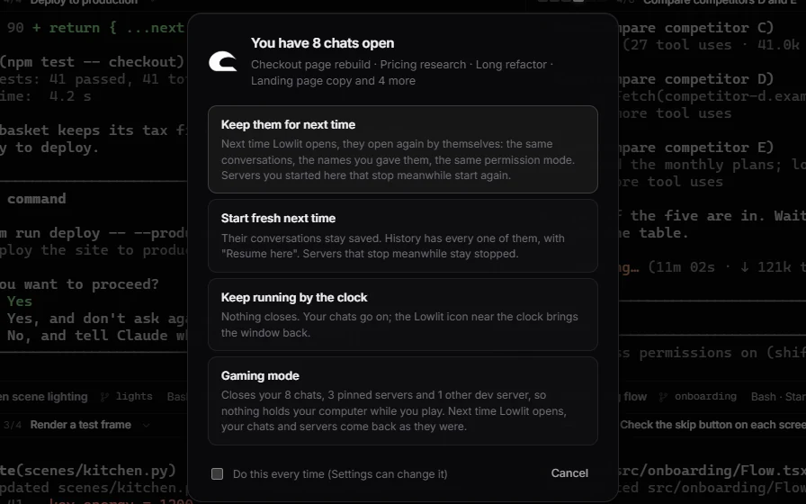</a></td>
  </tr>
  <tr>
    <td><b>Search.</b> <code>Ctrl Shift P</code>: jump to a chat, find something you typed, run a command.</td>
    <td><b>Closing.</b> With chats open, it asks: keep them, start fresh, keep running by the clock, or gaming mode.</td>
  </tr>
</table>

Click a picture for the whole window. Every picture here is from Lowlit's own test window, with made-up chats.

And:

- **Which one needs you.** The list sorts your chats into Needs you, Finished, Working and Idle, with how long each has waited. `Ctrl Shift N` goes to the next one that waits.
- **The numbers.** Per chat: cost at API list prices, tokens, how full its context is, the RAM and processor of everything it started. Per account: the 5-hour and weekly limits, where they are heading, when they reset.
- **Chats that outlive the window.** A keeper process holds the terminals. Restart Lowlit, or let it crash: your chats run on.
- **A floating card** over your other programs: the chat in front, its plan, who needs you (`Ctrl Shift F`).
- **The Nest.** One big chat kept apart for a folder of your own, a key away from any program.
- **Gaming mode.** Closes every chat and dev server, and brings them back next time.

## Usage limits

Claude Code hands your plan's limits (Pro and Max) to one place only: a status line command. Lowlit ships one. Add it to `~/.claude/settings.json`, with the path to your clone written in forward slashes:

```json
{
  "statusLine": { "type": "command", "command": "node C:/path/to/lowlit/app/statusline.cjs" }
}
```

Each chat then shows a line like `Opus 5.5 · context 8% · 5h 24% · week 41%` under its prompt, and the limit bars in Lowlit fill after your next message. It keeps the last figures in one file on your computer (`%LOCALAPPDATA%\AgentFocus\statusline.json`) and sends nothing anywhere.

Already have a status line? Keep it, and put Lowlit's in front of it:

```json
{
  "statusLine": { "type": "command", "command": "node C:/path/to/lowlit/app/statusline.cjs --pass | your-own-command" }
}
```

Cost, tokens, context and what each chat runs need none of this.

## The browser

The Browser is off until you switch it on in Settings > Browser. Lowlit then adds one entry, `lowlit-browser`, to Claude Code's own list of tools (an MCP server, for your user), and takes it out again when you switch it off. Chats you start after that can use it: ask one to "open the page and check it on a phone".

It listens on `127.0.0.1` only, with a key only Claude Code is given. It never opens a file that holds keys, a folder whose name starts with a dot, or AppData. Its logins stay in this browser, never in your own Chrome.

## What it reads, and what it never does

Lowlit reads, on your computer:

- the files Claude Code writes: which sessions run, their transcripts and their subagents (`~/.claude`);
- what Claude Code hands the status line, once you set that up (above);
- the name on the account that is logged in (its email, plan and id, from `~/.claude.json`), to tell your accounts apart;
- from Windows, the programs running under your sessions: their names, RAM, processor time and the ports they listen on.

It never:

- opens the file that holds your login (`~/.claude/.credentials.json`), or sees or stores the key in it;
- talks to Anthropic, logs in, logs out or switches accounts;
- drives Claude without a terminal, or changes Claude Code itself. A chat is the `claude` program in a terminal. Lowlit types into one only when you click a button that says so (Commit, Push, Compact now, Continue all), never by itself.

Nothing leaves your computer, with two exceptions that are yours to switch on. Pages opened in the Browser go to their sites, as in any browser. Jev, off by default, sends a finished chat's last answer to an outside model through OpenRouter, with your own key and a monthly cap, to judge whether the chat needs you.

Settings > What it reads says the same inside the app.

## Is this for you?

Anthropic's own desktop app runs several Claude Code sessions side by side, with its own interface. If that is what you want, use it: it is good.

Lowlit is for people who live in the terminal `claude` and want to keep it: the same program, your own configuration, many at once. It is the public copy of the desk its author works at every day.

It is early, and Windows only for now. Expect rough edges, and tell me about them. If it is useful to you, a star helps other people find it.

## Keys

| Key | What it does |
| --- | --- |
| `Ctrl Shift P` | Search chats, commands, things you typed |
| `Ctrl Shift T` / `W` | New chat / close the chat that has the keyboard |
| `Ctrl Shift N` | Next chat that needs you |
| `Ctrl 1 … 9` | A chat by its number in the list |
| `Ctrl Shift 1 … 9` | Every chat, then a workspace by its tab |
| `Ctrl Shift Enter` | One chat big, or back to side by side |
| `Ctrl Shift B` / `M` | The Browser / the Viewer |
| `Ctrl Shift U` / `H` | Dashboard / History |
| `Ctrl Shift F` | The floating card |
| `Ctrl Shift Space` | The Nest, from any program |
| `Ctrl ,` | Settings, with every key |

## Contributing

```
npm run check
```

checks that every script compiles and that no two page scripts use the same name. The app has a self-test that runs in a hidden window with made-up chats, one area at a time:

```
powershell -File app\dev\run-selftest.ps1 -Name mine -Only browser -Quiet
```

See [CONTRIBUTING.md](CONTRIBUTING.md). To report a security problem, see [SECURITY.md](SECURITY.md).

## Licence

[MIT](LICENSE). The fonts in `app/fonts` are Inter and Geist Mono, under the SIL Open Font License; their licences sit beside them.

Lowlit is not made by, or affiliated with, Anthropic. Claude and Claude Code are trademarks of Anthropic.
