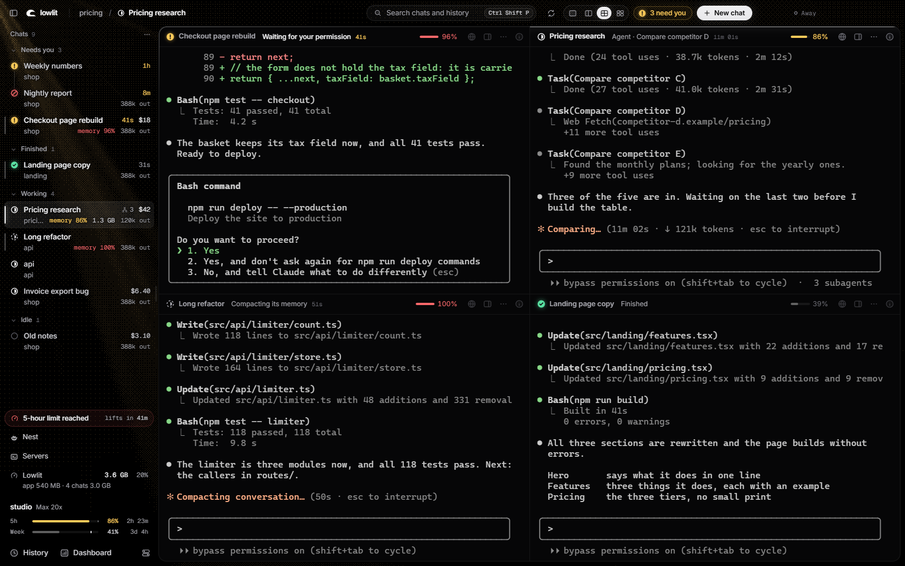
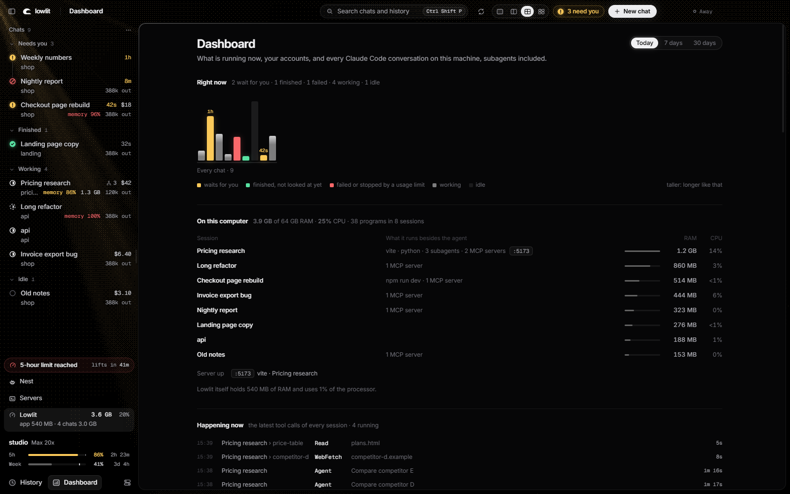
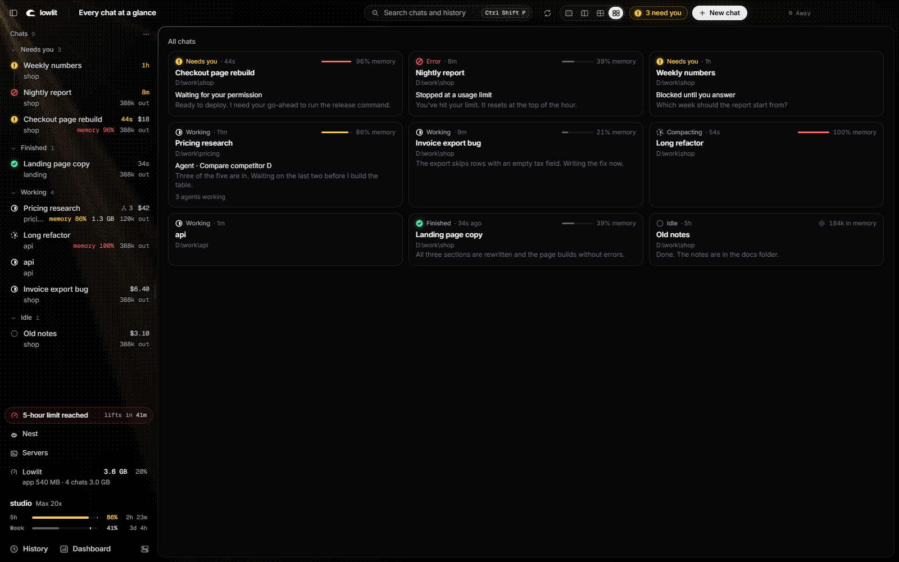
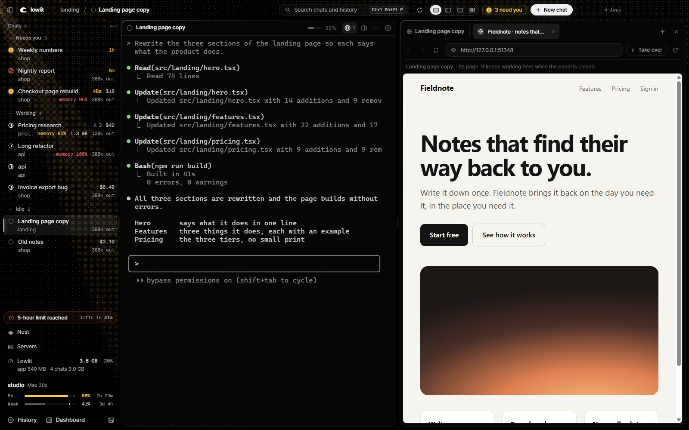
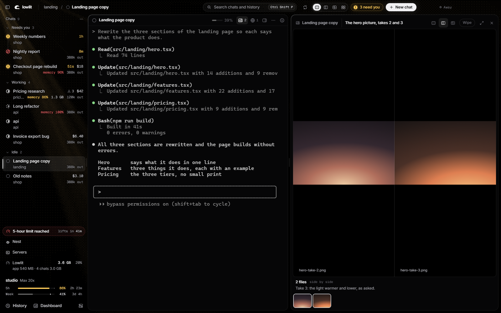

<p align="center">
  <picture>
    <source media="(prefers-color-scheme: dark)" srcset="assets/lockup-white.png">
    
  </picture>
</p>

<p align="center">
  <b>A quiet desk for your Claude Code chats.</b><br>
  Every chat in one window, each one a real terminal running the real <code>claude</code>, with the numbers beside them.
</p>

<p align="center">Windows 10 and 11 &nbsp;·&nbsp; free &nbsp;·&nbsp; MIT &nbsp;·&nbsp; runs on your computer only</p>



## Why

Run five Claude Code chats at once and the chats stop being the hard part. The hard part is knowing which one waits for you, how much of your plan is left, and what each of them has running on your machine. Lowlit puts every chat in one window and answers those three at a glance.

It does not wrap or replace Claude Code. Each chat is a terminal running the `claude` program you already have, so your settings, hooks, MCP servers, plugins and slash commands work as they always do. Lowlit reads the files Claude Code writes on your disk and shows what they say.

## What it does

**Every chat in one window.** One, two or four chats side by side, or all of them as cards. Workspaces group them by folder. One search box (`Ctrl Shift P`) finds any chat, command or thing you typed.

**Which one needs you.** The list sorts your chats into Needs you, Finished, Working and Idle, with how long each has waited. A permission question or a usage limit puts a chat on top. `Ctrl Shift N` goes to the next one that waits.

**The numbers.** Beside each chat: what it cost at API list prices, its tokens, how full its context is, and the RAM and processor that it and everything it started take. For your account: the 5-hour and weekly limits, where they are heading at your pace, and when they reset.

**A browser each chat can drive.** Lowlit offers Claude Code a browser of its own. A chat opens pages, reads them, clicks, types, takes pictures, looks at a page as a phone, a tablet and a laptop in one call, and records a GIF of what it did. You watch beside the chat and can take a page over. Sites on an ask-first list (your mail, payments, private messages, password managers) wait for your yes.

**A viewer for what the chats make.** Pictures, videos and sounds open beside the chat that made them: two takes side by side, a wipe to compare them, a video the chat can play, pause and step through.

**Chats that outlive the window.** The terminals are held by a small keeper process. Restart Lowlit, or let it crash, and your chats keep running and are there when it opens again.

**And the rest.** A Dashboard (what runs now, each session's programs and ports, the latest tool calls, today / 7 days / 30 days). History over every past conversation on the machine, with "Resume here". A Servers page to pin, start and stop the dev servers of your projects. The Nest, one big chat kept apart for a folder of your own, a key away from any program. A floating card over your other programs. Gaming mode, which closes every chat and dev server and brings them back next time.

<table>
  <tr>
    <td width="50%"></td>
    <td width="50%"></td>
  </tr>
  <tr>
    <td align="center"><sub>The Dashboard: what runs now, and what each session holds on your machine.</sub></td>
    <td align="center"><sub>Every chat at a glance.</sub></td>
  </tr>
  <tr>
    <td></td>
    <td></td>
  </tr>
  <tr>
    <td align="center"><sub>The Browser: the page a chat works in, beside the chat.</sub></td>
    <td align="center"><sub>The Viewer: two takes of a picture, side by side.</sub></td>
  </tr>
</table>

Every picture here was taken from Lowlit's own test window, with made-up chats.

## Install

You need Windows 10 or 11, [Node.js](https://nodejs.org) 20 or newer, Git, and Claude Code installed and logged in (typing `claude` in a terminal starts it).

```
git clone https://github.com/anessbelbati/lowlit
cd lowlit
npm install
npm start
```

`npm install` downloads Electron and the terminal parts, ready built: nothing is compiled on your machine. To open Lowlit without a terminal, double-click `app\Lowlit.vbs`, or add it to the Start menu in Settings > Opening Lowlit.

Chats you start in Lowlit run in Lowlit. The ones already running in other terminals show up in the list too, with their state and their numbers.

## Usage limits

Claude Code hands your plan's limits (Pro and Max) to one place only: a status line command. Lowlit ships one. Add it to `~/.claude/settings.json`, with the path to your clone written in forward slashes:

```json
{
  "statusLine": { "type": "command", "command": "node C:/path/to/lowlit/app/statusline.cjs" }
}
```

Each chat then shows a line like `Opus 5.5 · context 8% · 5h 24% · week 41%` under its prompt, and the limit bars in Lowlit fill after your next message. It keeps the last figures in one file on your computer (`%LOCALAPPDATA%\AgentFocus\statusline.json`) and sends nothing anywhere.

Already have a status line? Keep it, and put Lowlit's in front of it:

```json
{
  "statusLine": { "type": "command", "command": "node C:/path/to/lowlit/app/statusline.cjs --pass | your-own-command" }
}
```

Cost, tokens, context and what each chat runs need none of this.

## The browser

The Browser is off until you switch it on in Settings > Browser. Lowlit then adds one entry, `lowlit-browser`, to Claude Code's own list of tools (an MCP server, for your user), and takes it out again when you switch it off. Chats you start after that can use it: ask one to "open the page and check it on a phone".

It listens on `127.0.0.1` only, with a key only Claude Code is given. It never opens a file that holds keys, a folder whose name starts with a dot, or AppData. Its logins stay in this browser, never in your own Chrome.

## What it reads, and what it never does

Lowlit reads, on your computer:

- the files Claude Code writes: which sessions run, their transcripts and their subagents (`~/.claude`);
- what Claude Code hands the status line, once you set that up (above);
- the name on the account that is logged in (its email, plan and id, from `~/.claude.json`), to tell your accounts apart;
- from Windows, the programs running under your sessions: their names, RAM, processor time and the ports they listen on.

It never:

- opens the file that holds your login (`~/.claude/.credentials.json`), or sees or stores a key;
- talks to Anthropic, logs in, logs out or switches accounts;
- drives Claude without a terminal, or changes Claude Code itself. A chat is the `claude` program in a terminal. Lowlit types into one only when you click a button that says so (Commit, Push, Compact now, Continue all), never by itself.

Nothing leaves your computer, with two exceptions that are yours to switch on. Pages opened in the Browser go to their sites, as in any browser. Jev, off by default, sends a finished chat's last answer to an outside model through OpenRouter, with your own key and a monthly cap, to judge whether the chat needs you.

Settings > What it reads says the same inside the app.

## Is this for you?

Anthropic's own desktop app runs several Claude Code sessions side by side, with its own interface. If that is what you want, use it: it is good.

Lowlit is for people who live in the terminal `claude` and want to keep it: the same program, with your own configuration, many at once, and the things the terminal cannot show you around it. It is the public copy of the desk its author works at every day.

It is early. It runs on Windows only for now. Expect rough edges, and tell me about them.

## Keys

| Key | What it does |
| --- | --- |
| `Ctrl Shift P` | Search chats, commands, things you typed |
| `Ctrl Shift T` / `W` | New chat / close the chat that has the keyboard |
| `Ctrl Shift N` | Next chat that needs you |
| `Ctrl 1 … 9` | A chat by its number in the list |
| `Ctrl Shift Enter` | One chat big, or back to side by side |
| `Ctrl Shift B` / `M` | The Browser / the Viewer |
| `Ctrl Shift U` / `H` | Dashboard / History |
| `Ctrl Shift Space` | The Nest, from any program |
| `Ctrl ,` | Settings, with every key |

## Working on it

```
npm run check
```

checks that every script compiles and that no two page scripts use the same name. The app has a self-test that runs in a hidden window with made-up chats, one area at a time:

```
powershell -File app\dev\run-selftest.ps1 -Name mine -Only browser -Quiet
```

See [CONTRIBUTING.md](CONTRIBUTING.md). To report a security problem, see [SECURITY.md](SECURITY.md).

## Licence

[MIT](LICENSE). The fonts in `app/fonts` are Inter and Geist Mono, under the SIL Open Font License; their licences sit beside them.

Lowlit is not made by, or affiliated with, Anthropic. Claude and Claude Code are trademarks of Anthropic.
